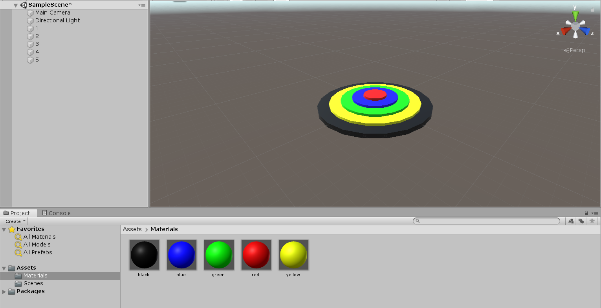
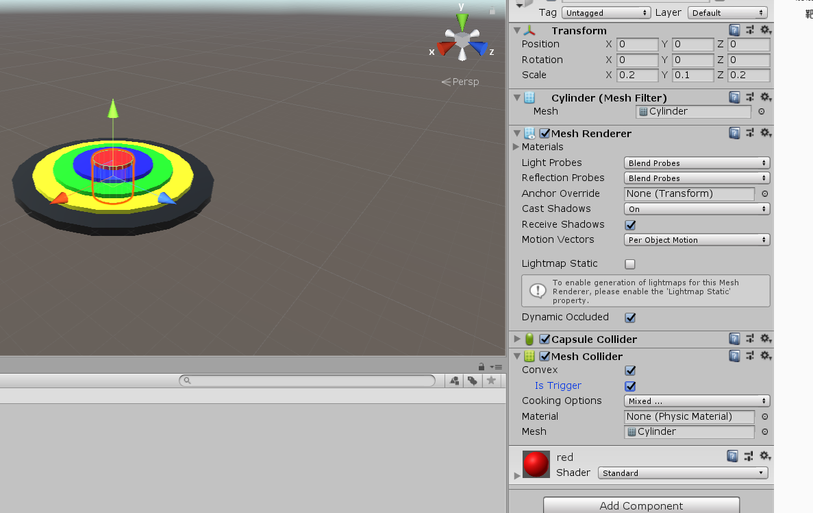
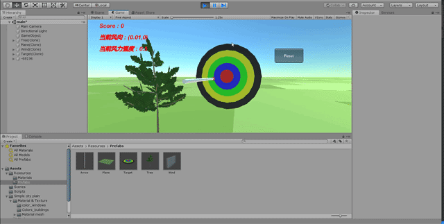

## 射箭游戏

游戏视频<<https://www.bilibili.com/video/av71160101/>>

上下左右控制箭移动，空格键发射、

### 靶对象

靶对象共有5环，由5个圆柱体组成，射中最中心的环得分5，射中最外层环得分为1。每个圆柱体都添加了`mesh collider`，勾选`Convex`，并且勾选了`is Trigger`作为触发器。





对于靶对象而言，它需要完成两种行为：

1. 作为触发器，感知是否有箭射中其中的某一环。
2. 作为model，包含每一环的分数。

`Target`上将挂载两个脚本，一个是`TargetData`，挂载到每一个环上，用来得到该环的分数；另一个是`TargetTrigger`，用来检测哪一个环被触发。

```c#
/* TargetData.cs */
public class TargetData : MonoBehaviour
{
    // 挂载到Target上的每一环，用来返回该环对应的分数。
    public int GetScore()
    {
        string name = this.gameObject.name;
        int score = 6 - (name[0] - '0');
        return score;
    }
}
```

```c#
/*TargetTrigger.cs*/
using System.Collections;
using System.Collections.Generic;
using UnityEngine;

public class TargetTrigger : MonoBehaviour
{
 

    // 当有箭射中某一环后触发
    void OnTriggerEnter(Collider arrow_head)
    {
        //得到箭身
        Transform arrow = arrow_head.gameObject.transform.parent;
        if (arrow == null)
        {
            return;
        }
        if (arrow.tag == "Arrow")
        {
            arrow_head.gameObject.SetActive(false);
            //箭身速度为0
            arrow.GetComponent<Rigidbody>().velocity = new Vector3(0, 0, 0);
            arrow.GetComponent<Rigidbody>().isKinematic = true;
            arrow.tag = "Hit";
            // 分数控制器
            int score = this.gameObject.gameObject.GetComponent<TargetData>().GetScore();
            Singleton<ScoreController>.Instance.AddScore(score);
            //Debug.Log(score);
        }
    }

}

```

然后将所有的圆柱体放到一个空物体上，做成预制。


### 箭

每一个箭由`head`和`body`组成，`head`装有`collider`。


箭挂载了`JoyStick`可以通过上下左右来控制方向，如果按下空格键将添加刚体`Rigidbody`，然后交由相应的动作控制器进行控制。

```c#
/*JoyStick.cs*/

using System.Collections;
using System.Collections.Generic;
using UnityEngine;


public class JoyStick : MonoBehaviour
{

    public float speedX = 1.0F;
    public float speedY = 1.0F;
    bool flag = true;
    // Update is called once per frame
    void Update()
    {
    	// 只有在射出前能移动
        if(flag)
        {
            float translationY = Input.GetAxis("Vertical") * speedY;
            float translationX = Input.GetAxis("Horizontal") * speedX;
            translationY *= Time.deltaTime;
            translationX *= Time.deltaTime;
            // 限制移动的范围
            if (transform.position.x - translationX < 1.5 && transform.position.x - translationX > -1.5
                && transform.position.y + translationY > -0.8 && transform.position.y + translationY < 0.8)
            {
                transform.position = transform.position + new Vector3(-translationX, translationY, 0);
            }
            if (Input.GetButton("Jump"))
            {
                // 如果空格下，则给箭增加刚体，使其能够进行物理学的运动
                this.gameObject.AddComponent<Rigidbody>();
                this.gameObject.GetComponent<Rigidbody>().useGravity = false;
                flag = false;
            }
        }
    }
}
```


### 风

风是由一系列透明的触发器组成的。


触发器们挂载了`WindTrigger`用来检测是否有箭头触发，然后交由相应的动作控制器控制。

```c#
/*WindTrigger*/
using System.Collections;
using System.Collections.Generic;
using UnityEngine;

public class WindTrigger : MonoBehaviour
{
    void OnTriggerEnter(Collider arrow_head)
    {
        //得到箭身
        Transform arrow = arrow_head.gameObject.transform.parent;
        if (arrow == null)
        {
            return;
        }
        if (arrow.tag == "Arrow")
        {
            arrow.GetComponent<CCAction>().Move();
        }
    }
}
```

风力大小和风向由`WindController`生成，挂载到全局的空物体上，使用单例模式获得。

```c#
/*WindController.sc*/
using System.Collections;
using System.Collections.Generic;
using UnityEngine;

public class WindController : MonoBehaviour
{

    private float time = 5;
    private float strength = 0.5f;
    private Vector3 direction = new Vector3(0.01f,0,0);

    // Update is called once per frame
    void Update()
    {
        if(time > 0)
        {
            time -= Time.deltaTime;
        }else
        {
            time = 5;
            strength = UnityEngine.Random.Range(0.5f, 0.7f);
            direction = new Vector3(UnityEngine.Random.Range(-0.02f, 0.02f), UnityEngine.Random.Range(-0.02f, 0.02f), 0);
        }
    }


    public float GetStrength()
    {
        return strength;
    }

    public Vector3 GetDirection()
    {
        return direction;
    }
}
```


### 场景控制器——FirstSceneController

由于本次作业依旧沿用了之前的`MVC`框架，所以只展示重要部分代码。

`FirstSceneController`挂载到空物体上，用来加载第一个场景（一共也只有一个场景）。

```c#
/*FirstSceneController.cs*/
using System.Collections;
using System.Collections.Generic;
using UnityEngine;

public class FirstSceneController : MonoBehaviour, ISceneController
{
    // 靶对象
    public GameObject target;
    // 箭队列
    public Queue<GameObject> arrowQueue = new Queue<GameObject>();
    // 当前正在操控的箭
    public GameObject arrow;
    // 风
    public GameObject wind;

    public void LoadSource()
    {
        // 清除记分
        Singleton<ScoreController>.Instance.ClearScore();
        // 靶对象初始化
        if (target != null)
        {
            Destroy(target);
        }
        target = GameObject.Instantiate<GameObject>(Resources.Load<GameObject>("Prefabs/Target"));

        if(arrow != null)
        {
            Singleton<ArrowFactory>.Instance.FreeArrow(arrow);
        }

        // 箭队列初始化
        while (arrowQueue.Count > 0)
        {
            Singleton<ArrowFactory>.Instance.FreeArrow(arrowQueue.Dequeue());
        }
        arrowQueue.Clear();

        // 初始化一个箭对象
        arrow = Singleton<ArrowFactory>.Instance.GetArrow();
        arrowQueue.Enqueue(arrow);
    }

    // Start is called before the first frame update
    void Start()
    {
        this.gameObject.AddComponent<ArrowFactory>();
        this.gameObject.AddComponent<ScoreController>();
        this.gameObject.AddComponent<IGUI>();
        this.gameObject.AddComponent<WindController>();
        wind = GameObject.Instantiate<GameObject>(Resources.Load<GameObject>("Prefabs/Wind"));
        // 设置第一个场景控制器为当前场景控制器
        Director.GetInstance().CurrentSceneController = this;
        Director.GetInstance().CurrentSceneController.LoadSource();
    }

    // Update is called once per frame
    void Update()
    {
        if(arrow.tag == "WaveEnd")
        {
            arrow = Singleton<ArrowFactory>.Instance.GetArrow();
            arrowQueue.Enqueue(arrow);
        }
    }
}

```

### 运动学控制器——CCAction (颤抖效果)

`CCAction`挂载到每个`Arrow`上，用来负责`Arrow`射中靶对象后的抖动效果以及遇到风之后产生的偏移效果。

```c#
/*CCAction.cs*/
using System.Collections;
using System.Collections.Generic;
using UnityEngine;

public class CCAction : MonoBehaviour, IAction
{
    private float time = 1;
    float radian = 0;
    float radius = 0.01f; 
    Vector3 initPosition;

    public void Move()
    {
        Move(Singleton<WindController>.Instance.GetDirection(), Singleton<WindController>.Instance.GetStrength());
    }

    public void Move(Vector3 direction, float strength)
    {
        this.transform.position += direction * strength;
    }

    // Start is called before the first frame update
    void Start()
    {
        
    }

    // Update is called once per frame
    void Update()
    {
        
        if(time > 0)
        {
            
            if (this.gameObject.tag == "Hit")
            {
                 time -= Time.deltaTime;
                // 弧度每次增加
                 radian += 0.05f;
                // 颤抖
                 float dy = Mathf.Cos(radian) * radius;
                 transform.position = initPosition + new Vector3(0, dy, 0);
            }
            else
            {
                initPosition = transform.position;
            }
        }
        if(time <= 0)
        {
            this.gameObject.tag = "WaveEnd";
            transform.position = initPosition;
        }
        
    }
}

```

### 动力学控制器——PhysicalAction

`PhysicalAction`也挂载到`Arrow`对象上，用来控制`Arrow`发射的运动效果。

```c#
/*PhysicalAction.cs*/
using System.Collections;
using System.Collections.Generic;
using UnityEngine;

public class PhysicalAction : MonoBehaviour, IAction
{

    float force = 3;

    public void Move(){}


    public void Move(float force)
    {
        this.force = force;
    }

    // Update is called once per frame
    void Update()
    {
        // 如果没有射中靶对象
        if(this.gameObject.transform.position.z < -1)
        {
            this.gameObject.tag = "WaveEnd";
        }
    }

    void FixedUpdate()
    {
        // 如果射中了靶对象
        if (this.gameObject.GetComponent<Rigidbody>() != null)
        {
            this.gameObject.GetComponent<Rigidbody>().AddForce(new Vector3(0, 0, -1) * force);
        }
    }

}
```

### 记分器——ScoreController

`ScoreController`也是使用单例模式，作为全局唯一来记录分数。

```c#

    {
        score = 0;
    }

    public void AddScore(int score)
    {
        this.score += score;
    }

    public int GetScore()
    {
        return this.score;
    }

}
```

### 效果展示




## 改进打飞碟游戏


增加一个运动的接口类`ActionManager`，物理运动`PhysicalAction`和运动学变换`CCAction`都将实现该接口。

```c#
public interface IActionManager
{
    void Move(Vector3 direction, float speed);
}
```

`CCAction`

```c#
public class CCAction : MonoBehaviour, IActionManager
{

    public Vector3 direction;
    public float speed;

    public void Move(Vector3 direction,float speed)
    {
        this.direction = direction;
        this.speed = speed;
    }

    // Start is called before the first frame update
    void Start()
    {
    }

    // Update is called once per frame
    void Update()
    {
        this.gameObject.transform.position += speed * direction * Time.deltaTime;
    }
}
```

对于`PhysicalManager`而言，`Move`函数是与其功能不匹配的，但是我们又不想丢弃这个`CCAction`和`ActionManager`，所以我们可以通过adapter模式，进行适配。

`PhysicalManager`

```c#
using System.Collections;
using System.Collections.Generic;
using UnityEngine;

public class PhysicalManager : MonoBehaviour, IActionManager
{

    public float speed;

    public void Move(float speed)
    {
        this.speed = speed;
    }
    public void Move(Vector3 direction, float speed)
    {
        Move(speed);
    }

    void FixedUpdate()
    {
        Rigidbody rigid = this.gameObject.GetComponent<Rigidbody>();
        if(rigid)
        {
            //Debug.Log(speed);
            rigid.AddForce(Vector3.down * speed);
        } 
    }

    // Start is called before the first frame update
    void Start()
    {
        this.gameObject.GetComponent<Rigidbody>().useGravity = false;
    }

}

```

