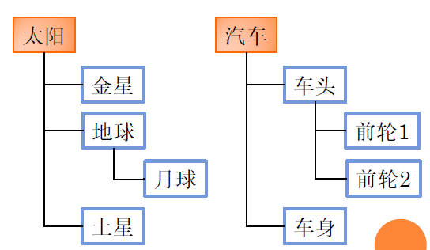
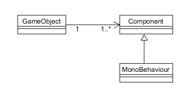
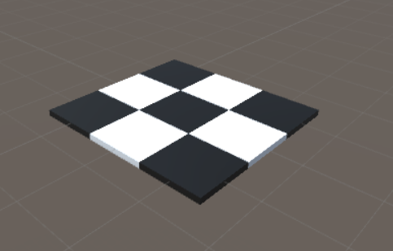
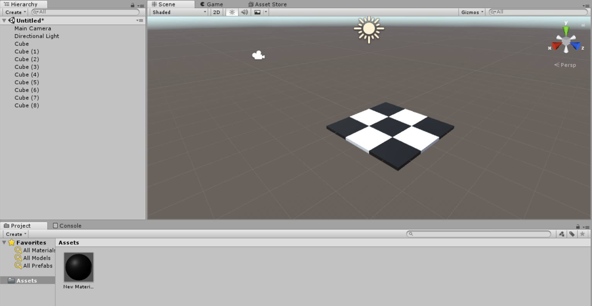
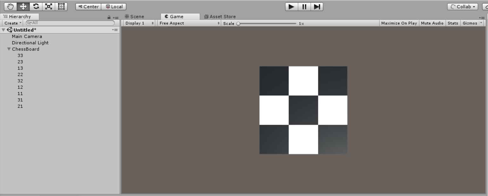
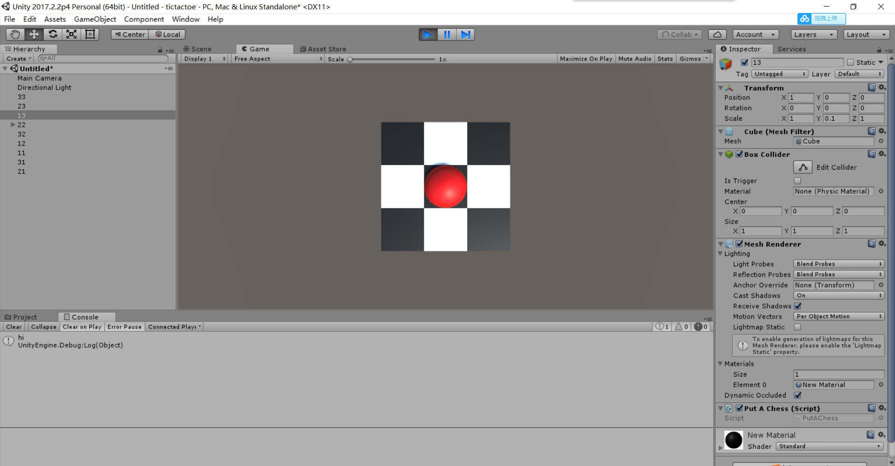
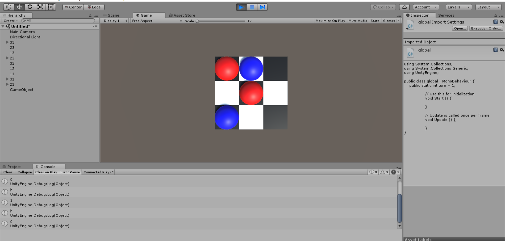
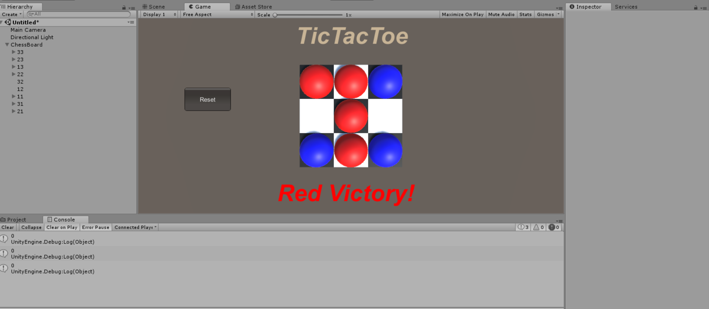
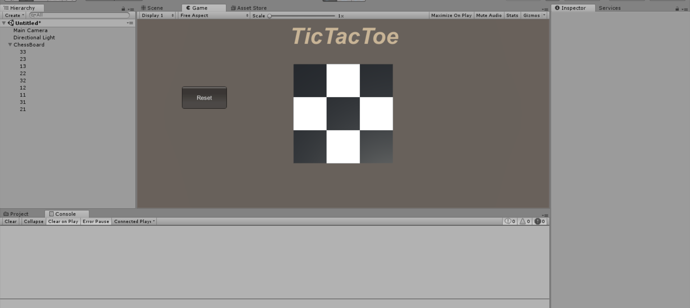
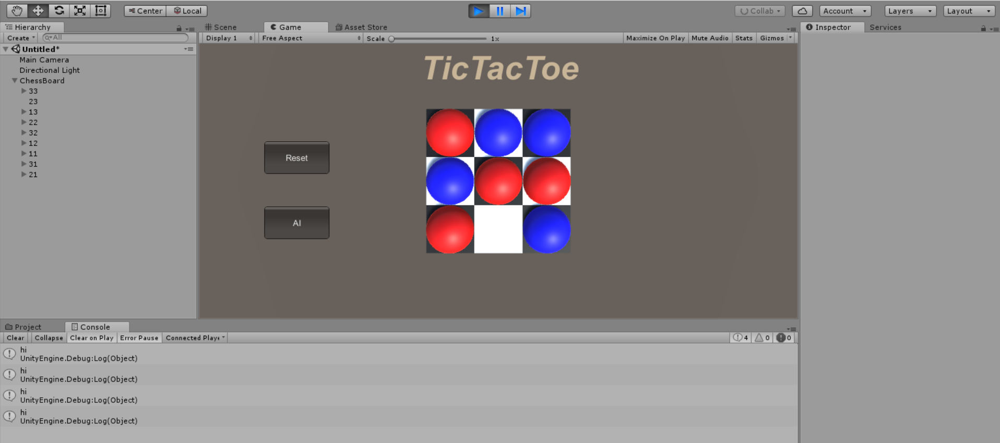

# 离散仿真引擎基础——井字棋

## 简答题

### 解释游戏对象（GameObjects）和资源（Assets）的区别与联系。

>对象：对象直接出现在游戏场景中，是资源整合的具体表现，对象一般有玩家，敌人，游戏场景，摄像机等虚拟父类，这些父类没有实例化，而他们的子类实例化并包含了这些游戏对象，我们可以对这些对象进行操作。
>资源：资源可以是我们自定义或下载下来的素材，可以被多个对象使用，有些资源可以做为模板并实例化为对象。资源文件夹（Asset）通常包含脚本，预设，场景，声音等
>——CSDN [hellowangld](https://blog.csdn.net/hellowangld/article/details/79665064)

在Unity3D中，游戏对象(GameObjects)是对象(Object)的子类，同时是场景内其他所有个体的基类。游戏对象可以使用资源(Assets)，同时资源也可以被实例化为对象。


### 下载几个游戏案例，分别总结资源、对象组织的结构（指资源的目录组织结构与游戏对象树的层次结构）

#### 资源的目录组织结构：

+ Models 模型文件

+ Plugins 主要是DLL的外部插件文件

+ Prefabs 预储存文件

+ Resources 动态加载的资源文件

+ Scenes 场景文件

+ Scripts 脚本代码文件

+ Sounds 音效文件

+ Textures 所有的贴图

#### 对象组织的结构




### 编写一个代码，使用 debug 语句来验证 MonoBehaviour 基本行为或事件触发的条件。

**基本行为包括 Awake() Start() Update() FixedUpdate() LateUpdate()，常用事件包括 OnGUI() OnDisable() OnEnable()**

```c#
using System.Collections;
using System.Collections.Generic;
using UnityEngine;

public class NewBehaviourScript : MonoBehaviour {
    // 基本行为包括 Awake() Start() Update() FixedUpdate() LateUpdate()，常用事件包括 OnGUI() OnDisable() OnEnable()

    void Awake()
    {
        Debug.Log("awake");
    }

    // Use this for initialization
    void Start () {
        Debug.Log("start");

	}
    // Update is called once per frame
    void Update () {
        Debug.Log("update");
	}

    void FixedUpdate()
    {
        Debug.Log("fixedupdate");
    }

    void LateUpdate()
    {
        Debug.Log("lateupdate");
    }

    void OnGUI()
    {
        Debug.Log("ongui");
    }

    void OnDisable()
    {
        Debug.Log("ondisable");
    }

    void OnEnable()
    {
        Debug.Log("onenable");
    }
}

```


### 查找脚本手册，了解GameObject，Transform，Component 对象

#### 分别翻译官方对三个对象的描述（Description）

GameObject: 游戏对象是统一体中代表人物、道具和场景的基本对象。它们本身并没有完成多少工作，但是它们充当组件的容器，组件实现真正的功能。

Transform: Transform组件决定场景中每个对象的位置、旋转和比例。每个GameObject(游戏物体)都有一个变换。

Component: 组件是游戏中对象和行为的螺母和螺栓。它们是每个游戏对象的功能部件。

#### 描述下图中 table 对象（实体）的属性、table 的 Transform 的属性、 table 的部件


table的对象是GameObject，第一个选择框是activeSelf 属性，第二个文本框是对象名称，第三个选择框为static属性。

Transform中的属性有位置、旋转、比例。

table的部件有Transform，Mesh Filter，Box Collider，Mesh Renderer。

#### 用 UML 图描述三者的关系（请使用 UMLet 14.1.1 stand-alone版本出图）



### 整理相关学习资料，编写简单代码验证以下技术的实现：

- 查找对象

```c#
	var obj = GameObject.Find("table");
	if(obj != null) {
        Debug.Log("find!");
    }
```

- 添加子对象

```c#
    GameObject obj = GameObject.CreatePrimitive(PrimitiveType.Cube);
	obj.name = "a cube";
    obj.transform.position = new Vector3(0, 0, 2);
    obj.transform.parent = this.transform;
```

- 遍历对象树

```c#
    GameObject[] objs = GameObject.FindObjectsOfType<GameObject>();
    foreach (GameObject obj in objs) {
        Debug.Log(obj.name);
    }
```

- 清除所有子对象

```c#
    int childCount = transform.childCount;
    for (int i = 0; i < childCount; i++)
    {
        Destroy(transform.GetChild(0).gameObject);
    }
```


### 资源预设（Prefabs）与 对象克隆 (clone)

- 预设（Prefabs）有什么好处？

>1. 使对象和资源能够重复利用。 
>
>2. 相同的游戏对象可以用同一个预制来创建。 
>
>3. 对预设进行修改后，所有的游戏对象都会发生改变。 
>
>总体而言，预设资源储存了完整储存了对象的组件和属性，相当于模板，使用预制能够方便我们创建相同的游戏对象并赋予他们相同的行为，比如用一块砖创建一堵墙。
>——CSDN [hellowangld](https://blog.csdn.net/hellowangld/article/details/79665064)

- 预设与对象克隆 (clone or copy or Instantiate of Unity Object) 关系？

>1. 克隆游戏对象需要场景中有被克隆对象，而创建预制只需事先创建预制即可，允许场景中一开始并不存在该游戏对象。
>2. 克隆出来的游戏对象并不会随着被克隆体的变化而发生变化，但是使用预制创建出来的对象会随着预制的改变而发生改变。
>
>——CSDN [hellowangld](https://blog.csdn.net/hellowangld/article/details/79665064)

- 制作 table 预制，写一段代码将 table 预制资源实例化成游戏对象

>GameObject prefab = (GameObject)Instantiate (prefab1);
>
>——CSDN [hellowangld](https://blog.csdn.net/hellowangld/article/details/79665064)

## 编程实践——井字棋

完整代码地址（<https://github.com/JennySRH/3DGame/tree/master/tictactoe>）

首先，我们用9个方块搭建井字棋的棋盘。





然后再建立一个空的GameObject来管理9块棋牌格子，也方便后续全局变量的使用。



回想小时候玩的井字棋，当你要下棋时，你需要在格子上放置一个棋子。在电脑游戏中，也就意味着点击棋盘会产生一颗棋子。我们调用`MonoBehaviour `基本行为/事件触发的条件`OnMouseDown`。当鼠标点击格子时，将会新增一个GameObject并以被点击的棋盘格子为父类。这个新增的游戏对象将会位于选中的棋盘格子，充当棋子。

```c#
    void OnMouseDown()
    {
        GameObject obj = GameObject.CreatePrimitive(PrimitiveType.Sphere);
        Vector3 player_postion = this.transform.position;
        obj.transform.position = player_postion;
        obj.transform.parent = this.transform;
        obj.GetComponent<MeshRenderer>().material.color = Color.red;
    }
```

进行测试可以看出，通过点击，已经有棋子出现在棋盘上了。



因为玩井字棋是回合制的，也就是说红方执子先下，蓝方执子后下，循环往复。所以我们需要记住下一回合应该是红方下棋还是蓝方下棋。我们使用一个全局变量`turn`来记录当前下棋的人。然后更改`OnMouseDown`事件的函数，当`turn=1`时，红方下棋，并令`turn=0`。

```c#
public class global : MonoBehaviour {
    public static int turn = 1;

}


public class PutAChess : MonoBehaviour {

    void OnMouseDown()
    {
        GameObject obj = GameObject.CreatePrimitive(PrimitiveType.Sphere);
        Vector3 player_postion = this.transform.position;
        obj.transform.position = player_postion;
        obj.transform.parent = this.transform;
        if(global.turn==1)
        {
            obj.GetComponent<MeshRenderer>().material.color = Color.red;
            global.turn = 0;
        }
        else
        {
            obj.GetComponent<MeshRenderer>().material.color = Color.blue;
            global.turn = 1;
        }
    }
}

```

可以看出，我们的井字棋游戏已经有了基本的雏形了。



下面要考虑一个问题：如何判断棋局的胜负？

我们增加一个全局变量`chess[][]`这个二维数组记录当前棋盘局势。除此之外增加一个全局变量`flag`记录当前胜利方。在`global`类中的`Update`事件中，检查当前棋局是否产生胜利，如果红方胜利就将flag设置为1，蓝方胜利就将flag设置为2，否则则为0。

每次下棋，都将修改全局变量`chess`。

```c#
    void OnMouseDown()
    {
        string str = this.name;
        if(global.chess[str[0]-'1'][str[1]-'1'] != 0)
        {
            return;
        } 
        GameObject obj = GameObject.CreatePrimitive(PrimitiveType.Sphere);
        obj.name = ("temp"+str);
        Vector3 player_postion = this.transform.position;
        obj.transform.position = player_postion;
        obj.transform.parent = this.transform;
        if(global.turn==1)
        {
            obj.GetComponent<MeshRenderer>().material.color = Color.red;
            global.turn = 0;
            global.chess[str[0] - '1'][str[1] - '1'] = 1;
        }
        else
        {
            obj.GetComponent<MeshRenderer>().material.color = Color.blue;
            global.turn = 1;
            global.chess[str[0] - '1'][str[1] - '1'] = 2;
        }
    }
```

然后在全局类（棋盘格子父类）中检查棋局形式。

```c#
    void CheckWin()
    {
        if (flag > 0)
        {
            return;
        }
        // 遍历所有对象
        for (int i = 0; i < 3; i++)
        {
            if (chess[i][0] != 0 && chess[i][0] == chess[i][1] && chess[i][1] == chess[i][2])
            {
                flag = chess[i][0];
            }
            if (chess[0][i] != 0 && chess[0][i] == chess[1][i] && chess[1][i] == chess[2][i])
            {
                flag = chess[0][i];
            }
        }
        if (chess[0][0] != 0 && chess[0][0] == chess[1][1] && chess[1][1] == chess[2][2])
        {
            flag = chess[0][0];
        }
        if (chess[0][2] != 0 && chess[0][2] == chess[1][1] && chess[1][1] == chess[2][0])
        {
            flag = chess[0][2];
        }
    }

    // Update is called once per frame
    void Update () {
        CheckWin();
        
    }
```

这样我们就可以获得带有胜负检验的井字棋了。



但是这个井字棋还是不够完善，比如说，如果我们想要重置棋盘，只能关闭游戏再打开游戏，这样带来诸多不便。这就需要设置一个`Reset`键进行重置棋盘。

在棋盘父类`global`中，我们通过OnGUI的相关API，进行棋盘的恢复。点击`Reset`键后，会调用`Reset`函数。

```c#
    void OnGUI()
    {
        GUIStyle style = new GUIStyle
        {
            border = new RectOffset(10, 10, 10, 10),
            fontSize = 50,
            fontStyle = FontStyle.BoldAndItalic,
        };
        // normal:Rendering settings for when the component is displayed normally.
        style.normal.textColor = new Color(200 / 255f, 180 / 255f, 150 / 255f);    // 需要除以255，因为范围是0-1
        GUI.Label(new Rect(340, 10, 200, 80), "TicTacToe", style);
        
        if(GUI.Button(new Rect(100, 150, 100, 50), "Reset"))
        {
            Reset();
        }
        if (flag == 1)
        {
            style.normal.textColor = new Color(255 / 255f, 0 / 255f, 0 / 255f);
            GUI.Label(new Rect(300, 350, 200, 80), "Red Victory!", style);
        }
        else if(flag == 2)
        {
            style.normal.textColor = new Color(0 / 255f, 0 / 255f, 255 / 255f);
            GUI.Label(new Rect(300, 350, 200, 80), "Blue Victory!", style);
        }

    }
```

`Reset`函数只用来重置所有的全局变量，具体的清除操作由子类完成，具体函数如下所示：

```c#
    void Reset()
    {
        flag = 0;
        turn = 1;
        for(int i = 0;i < 3;i ++)
        {
            for(int j = 0;j < 3;j ++)
            {
                chess[i][j] = 0;
            }
        }
    }
```

当全局变量`flag`设置为0时，各个子类的`Update`函数将会清除子类棋子

```c#
	// Update is called once per frame
	void Update () {
        string str = this.name;
        if (global.chess[str[0] - '1'][str[1] - '1'] == 0)
        {
            int childCount = transform.childCount;
            for (int i = 0; i < childCount; i++)
            {
                Destroy(transform.GetChild(0).gameObject);
            }
        }
    }
```

然后只要`Reset`，就开始新的一局了！



往年的同学都有做人工智能部分，我们也不妨来尝试一下。所谓的人工智能，有多智能就有多人工。对于本款井字棋，我们只是简单的让对手随便下棋，权当是休闲益智游戏。

新增全局变量`ai`，用来记录当前游戏模式，然后对棋子的`OnMouseUp`事件进行修改，每次己方下完棋后，AI会接着下棋。

```c#
    void OnMouseUp()
    {
        if(global.ai==1)
        {
            GameObject[] objs = GameObject.FindObjectsOfType<GameObject>();
            foreach (GameObject temp in objs)
            {
                string str = temp.name;
                if(str.Length==2 && global.chess[str[0] - '1'][str[1] - '1']==0)
                {
                    Debug.Log("hi");
                    GameObject obj = GameObject.CreatePrimitive(PrimitiveType.Sphere);
                    obj.name = ("temp" + str);
                    Vector3 player_postion = temp.transform.position;
                    obj.transform.position = player_postion;
                    obj.transform.parent = temp.transform;
                    obj.GetComponent<MeshRenderer>().material.color = Color.blue;
                    global.turn = 1;
                    global.chess[str[0] - '1'][str[1] - '1'] = 2;
                    break;
                }
            }
        }
    }
```

效果如图所示




## 思考题【选作】

- 微软 XNA 引擎的 Game 对象屏蔽了游戏循环的细节，并使用一组虚方法让继承者完成它们，我们称这种设计为“模板方法模式”。
  - 为什么是“模板方法”模式而不是“策略模式”呢？

模板方法是改变算法的一部分。策略模式是使用委托改变整个算法。Template Method是一个旨在帮助我们在抽象层次从一组不同的步骤中概括出一个通用过程的模式：定义一个操作中算法的骨架，而将一些步骤延迟到子类中。不改变算法的结构而重定义它的步骤。Template Method模式并不是耦合的多个Strategy模式，它适用于存在几个互不相同但概念上相似的过程。每个过程的变化互相耦合的，因为它们都与某个过程有关。

